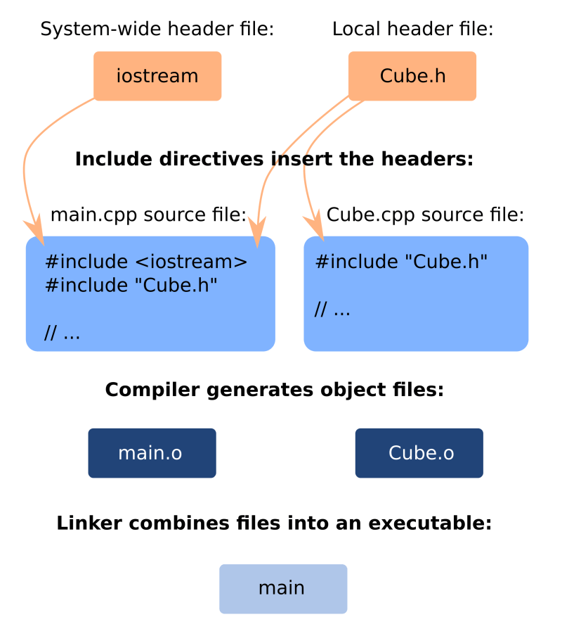

# The C++ Memory Model

## Stack Memory and Pointers

Every variable always has a name, a type, a value, and a location in memory.

The `&` operator returns the memory address of a variable.

By default, every variable is placed in stack memory. When the function returns or ends, the stack of that function is released.

*Warning:* Never return pointers to local variables (defined within a function's scope) because memory will be de-allocated after the function has returned.

The stack begins at a high memory address and works its way down, whereas the heap begins at a low memory address and works its way up.

## Heap Memory

If memory needs to exist for longer than the lifecycle of a function, we must use heap memory:

```c++
int *allocate_an_integer() {
  int *i = new int;
  *i = 0;
  return i;
}
```

The only way to create heap memory in C++ is with the `new` operator, which:

1. allocates memory on the heap for the data structure
2. initializes the data structure, and
3. returns a pointer to the start of the data structure.

This memory exists for the entire length of a programme, unless the pointer is passed to the `delete` operator!

In this example, `c` and `p` are on the stack pointing to the respective data structures created on the heap. After deleting the data structures on the heap which `c` and `p` point to, it is necessary to then assign the `nullptr` to these pointers to avoid dangling pointers:

```c++
#include "Cube.h"
using uiuc::Cube;

int main() {
  int *p = new int;
  Cube *c = new Cube;

  *p = 42;
  c->setLength(4);

  delete c; c = nullptr;
  delete p; p = nullptr;
  return 0;
}
```

## C++ Code Organization: Headers and Source Files

`.h` files are "header files". They contain **declarations** (where classes and custom types are listed by name and type, and function prototypes give functions a type signature). Recently, some people name header files with a `.hpp` suffix instead.

All header files start with `#pragma once`. Instructions beginning with a `#` are special commands for the compiler, called **preprocessor directives**. This instruction prevents the header file from being automatically included multiple times in a complex project, which would cause errors.

For example, this header file contains the declaration of the Cube class, including listing its members, but the definition doesn't give the full source code of the functions here. The class' methods will be defined in the source code file.

```c++
/**
 * Simple C++ class for representing a Cube.
 *
 * @author
 *   Wade Fagen-Ulmschneider <waf@illinois.edu>
 */

#pragma once

class Cube {
 public:
  double getVolume();
  double getSurfaceArea();
  void setLength(double length);

 private:
  double length_;
};

```

`.cpp` files are often called the "implementation files," or simply the "source files". They contain **implementation** (where function bodies are actually defined, and some constant values are initialized).

```c++
/**
 * Simple C++ class for representing a Cube.
 *
 * @author
 *   Wade Fagen-Ulmschneider <waf@illinois.edu>
 */

#include "Cube.h"

double Cube::getVolume() {
  return length_ * length_ * length_;
}

double Cube::getSurfaceArea() {
  return 6 * length_ * length_;
}

void Cube::setLength(double length) {
  length_ = length;
}

```

In the main file there are two `#include` directives! First, it includes a standard library header from the system directory. This is shown by the use of `< >`. When you write `#include <iostream>`, the compiler will look for the iostream header file in a system-wide library path that is located outside of your current directory.

```c++
/**
 * C++ code for creating a Cube of length 2.4 units.
 * - See ../cpp-std/main.cpp for a similar program with print statements.
 *
 * @author
 *   Wade Fagen-Ulmschneider <waf@illinois.edu>
 */

#include <iostream>
#include "Cube.h"

int main() {
  Cube c;

  c.setLength(3.48);
  double volume = c.getVolume();
  std::cout << "Volume: " << volume << std::endl;

  return 0;
}

```

Next, it does #include `"Cube.h"` just like in the Cube.cpp file. You have to include the necessary headers in every cpp file where they are needed. However, you shouldn't literally include one cpp file in another! There is no need to write #include "Cube.cpp" because the function definitions in the Cube.cpp file will be compiled separately and then linked to the code from the main.cpp file:



## C++ Syntax Notes: Basic Operators, If-Else, Type Casting, Block Scope, Loops

### Type Casting

Casting is the phenomenon where a value is automatically converted to a different type in order to allow an operation to continue. For example, if you try to add together a floating point double value and an integer int value, the int will be converted to double first, and then the result of the addition will have type double as well. But if you save a double value to an int variable, the floating point value will be truncated to an integer! For example:

```c++
#include <iostream>

int main() {
  int x = 2;
  double y = 3.5;
  std::cout << "This result will be a double with value 5.5: " << (x+y) << std::endl;

  int z = x+y; // This expression is calculated as a double, but then it's cast back to int!
  std::cout << "This result will be an int with value 5: " << z << std::endl;
  return 0;
}

```

It's also the case that various values can be cast to the Boolean bool type. So, they can be used as a condition. For example, usually, nonzero numeric values will be considered true, and zero will be considered false.

*You need to be aware that casts are happening invisibly in your code!*

Links:

- [A more detailed primer on the casting topic](http://www.cplusplus.com/doc/tutorial/typecasting/)
- [In-depth documentation](https://en.cppreference.com/w/cpp/language/implicit_conversion)
